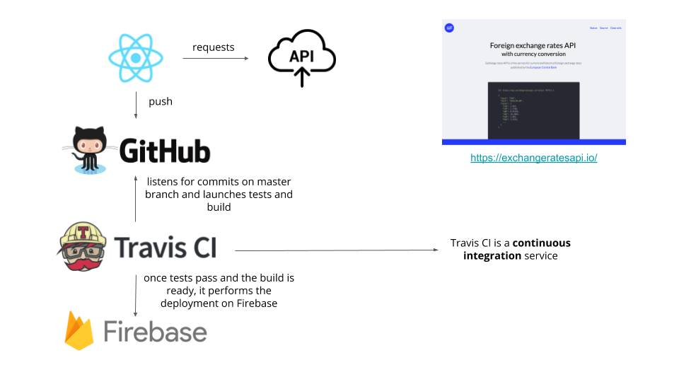

## Usage

```
npm start
```

## Run tests

```
npm test
```

## Build

```
npm run build
```

## Architecture



## How to setup Travis CI and Firebase deployment

1. Ensure that your project has a repository on GitHub
2. Navigate to `https://travis-ci.org/` and **login with GitHub**
3. _TBD_
4. _TBD_
5. _TBD_

## Deploy

```
git add .
git commit -m "Some changes ready for production"
git push
```

Once Travis CI job is done, you can see your changes at https://react-charts-demo.firebaseapp.com/

## Conclusion


## Bonus

Are you courious about the size of your bundle? Let's discover it!

```
npm install --save source-map-explorer
```

Then edit the `package.json` file adding the following script

```
 "scripts": {
+    "analyze": "source-map-explorer 'build/static/js/*.js'",
     "start": "react-scripts start",
     "build": "react-scripts build",
     "test": "react-scripts test",
```

and then run

```
npm run build
npm run analyze
```


